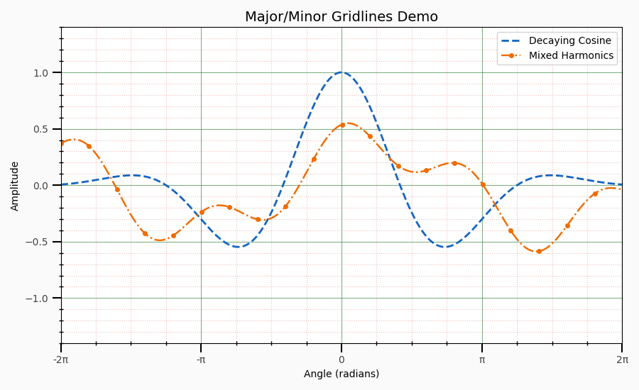

# Gridlines Demo (Major vs. Minor)

A compact matplotlib example showing **major** and **minor** gridlines with different styles, plus custom tick locators and π-formatted x‑axis labels.

## ✨ What it shows
- Two original curves (decaying cosine + mixed harmonics)
- Major gridlines (green, solid) vs. minor gridlines (red, dotted)
- Custom tick locators: major every π, minor every π/4
- Pretty π labels via a formatter (−2π … 2π)

## ▶️ Run it
```bash
python gridlines_demo.py
```

To save a screenshot for your README, run:
```bash
python -c "import gridlines_demo as g; g.plot_gridlines_demo(save_png=True)"
```
This will create **gridlines_demo.png** in the project folder.

## 📷 Output (add after you save one)
```markdown

```

## Requirements
- Python 3.x
- matplotlib
- numpy

## License
MIT — feel free to use and adapt.
